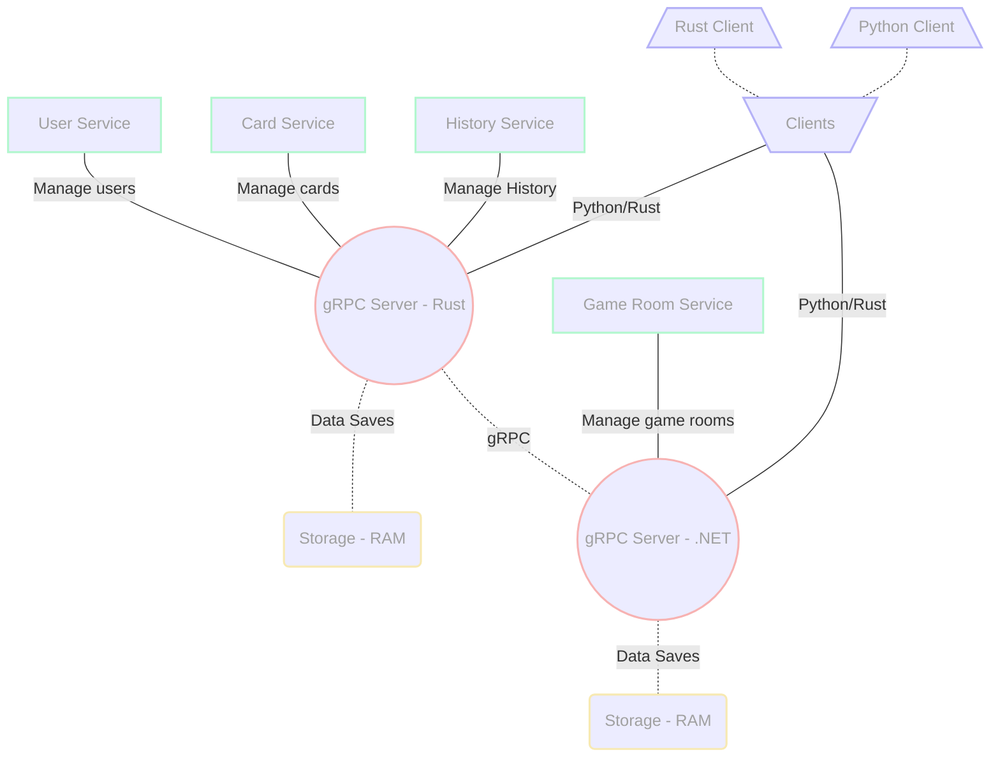
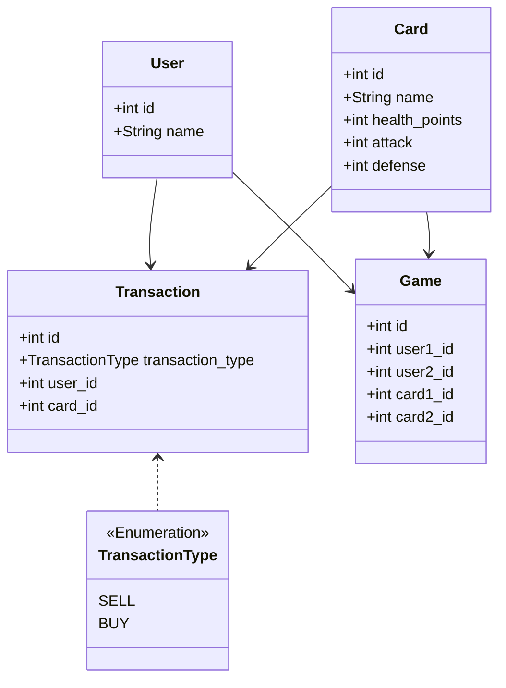

# RPC_Experiment

- Johan Planchon ([Client_1](./Client_1/README.md))
- Julo Caposiena ([Server_2](./Server_2/README.md))
- Batiste LALOI ([Client_2](./Client_2/README.md))
- Alexis LONCHAMBON ([Server_1](./Server_1/README.md))

## Première approche théorique de conception de l'architecture logicielle

Mise en place d'un serveur en Rust et de deux clients en Python et Rust. Le serveur Rust gère les utilisateurs, les cartes et les historiques de transactions. Le serveur .NET gère les salles de jeu. Les deux serveurs communiquent entre eux via gRPC.

Si on utilise trois ordinateurs connectés au même réseau wifi, on peut lancer le serveur Rust, le client Python et le client Rust sur trois ordinateurs différents. Le client Python et le client Rust peuvent communiquer avec le serveur Rust sur la base d'une simple interaction de type "Hello [Nom du client]".

### Voila par exemple le l'éxécution du client Rust : 

- Terminal 1 : Serveur Rust gRPC

- Terminal 2 : Client_1 Rust

- Terminal3 : Utilisation de la commande `ss -lntup` pour voir les ports utilisés par les processus et voir que le serveur Rust écoute sur le port 50051

### Voici l'éxécution du client Python :

- Terminal 1 : Serveur de test en Python

- Terminal 2 : Client_2 Python qui se connecte au serveur de test

## Diagramme de séquence de l'interaction avec une salle de jeu

## Diagramme de classe des données

