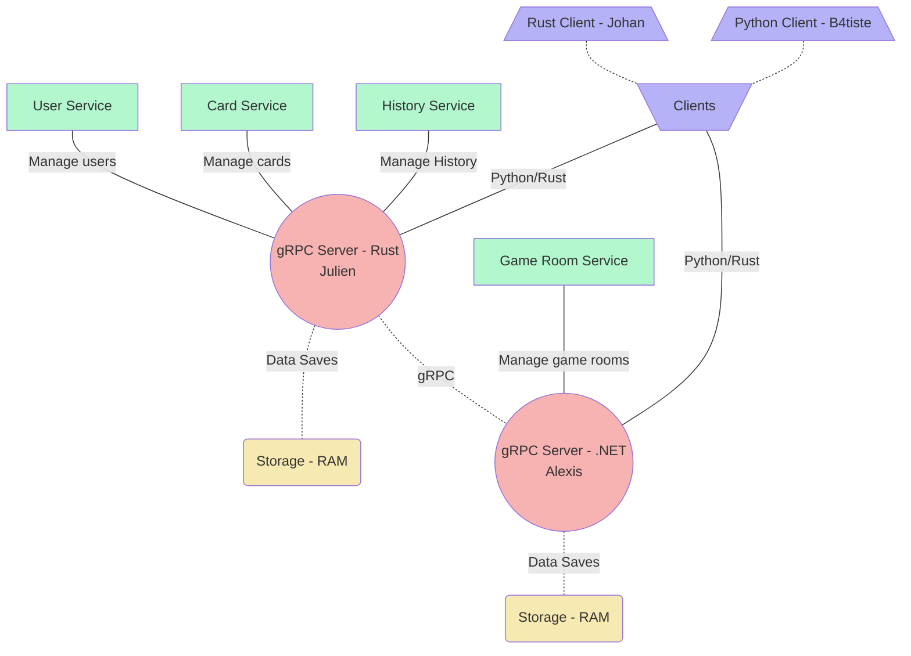

# RPC_Experiment

- Johan Planchon ([Client_1](./Client_1/README.md))
- Julo Caposiena ([Server_2](./Server_2/README.md))
- Batiste LALOI ([Client_2](./Client_2/README.md))
- Alexis LONCHAMBON ([Server_1](./Server_1/README.md))

## Schéma de l'architecture

